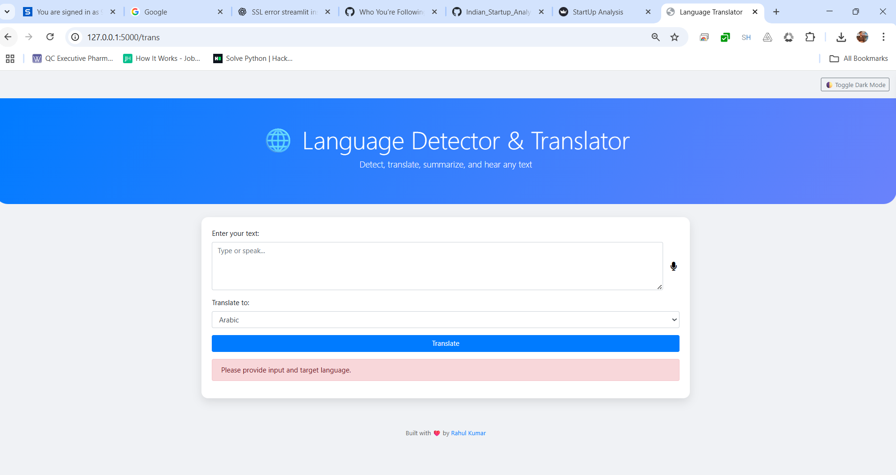
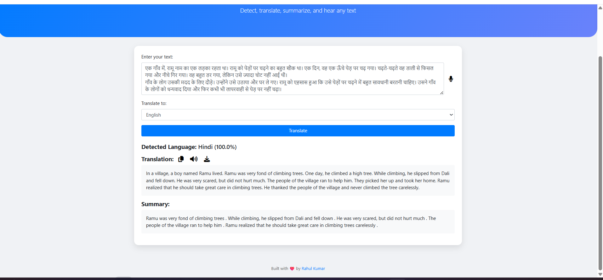

# 🌐 Language Detection, Translation & Summarization Web App

This is a professional-grade **Flask web application** that allows users to:

- 🔍 Automatically detect the input language
- 🌎 Translate text into 20+ supported languages using a trained ML model (not Google API)
- 🧠 Summarize translated text using Hugging Face Transformers
- 🎤 Convert speech-to-text and listen to translated output via text-to-speech
- 📥 Download translated results
- 🌙 Toggle dark/light theme with cookie memory

---

## 💡 Features

- ✅ **Language Detection** (via trained scikit-learn model)
- ✅ **Text Translation** to multiple languages
- ✅ **Text Summarization** after translation
- ✅ **Speech-to-Text** (input by microphone)
- ✅ **Text-to-Speech** (audio output of translation)
- ✅ **Download Translated Text**
- ✅ **Dark Mode Toggle** with cookie storage
- ✅ **Responsive & Animated UI** using Bootstrap 4 + FontAwesome

---

## 📁 Project Structure

```bash
📦 language-translator-app/
├── app.py                  # Flask backend application
├── requirements.txt        # Python dependencies
├── Procfile                # Gunicorn process startup (for Render)
├── render.yaml             # Optional Render deployment config
├── model.pkl               # Trained ML model for language translation
├── vectorizer.pkl          # TF-IDF or similar vectorizer
├── templates/
│   └── index.html          # Frontend interface
├── README.md               # Project documentation


## 🌐 Live Demo

You can also check the live version here:  
🔗 [https://indian-startup-analysis-57rq.onrender.com/]


## 🚀Local Setup Instructions

1. **Clone the repository**
```bash
    git clone https://github.com/Singhrahul2511/language-translator-app.git
    cd language-translator-app
```

2. **(Optional) Create and activate virtual environment**
 ```bash
python -m venv .venv
.venv\Scripts\activate       # On Windows
source .venv/bin/activate    # On Linux/Mac
```

3. **Install required packages**
 ```bash
pip install -r requirements.txt -f https://download.pytorch.org/whl/cpu/torch_stable.html
```

4. **Run the Flask app locally**
 ```bash
python app.py
Open your browser and go to:
🔗 http://127.0.0.1:5000
```

🌐 Deploy to Render (Free Cloud Hosting)
🛠️ Files required:
requirements.txt

Procfile

(optional) render.yaml

🧭 Steps:
Push your code to a GitHub repository

Go to https://render.com

Click New Web Service

Choose your repo

Set:

Build command: pip install -r requirements.txt

Start command: gunicorn app:app

📦 **Example Procfile**
 ```bash
web: gunicorn app:app
```
📦 **Example render.yaml**
 ```bash
services:
  - type: web
    name: language-translator-app
    runtime: python
    buildCommand: pip install -r requirements.txt
    startCommand: gunicorn app:app
    envVars:
      - key: FLASK_ENV
        value: production

```

## 🖼️ Features Demo (Screenshots) (optional)
### Dashboard Overview


### Translation Overview


### File Download Overview


## 🛠️ Built With
Flask

scikit-learn

transformers (Hugging Face)

gTTS / pyttsx3

SpeechRecognition

Bootstrap 4

Font Awesome

---

## 👨‍💻 Author

**Rahul Kumar**  
🔗 [LinkedIn](https://www.linkedin.com/in/rahul-kumar-8ab740268/)  
📧 aiwithrahul25@gmail.com  
🎥 [YouTube: AI with Rahul](https://www.youtube.com/@aiwithrahul25)

---